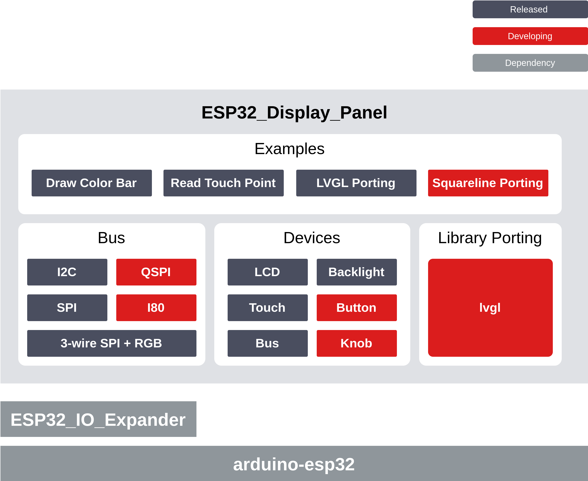

 

**最新 Arduino 库版本**: 

**最新 Espressif 组件版本**: 

# ESP Display Panel

* [English Version](./README.md)

## 概述

ESP32_Display_Panel 是 Espressif 专为 ESP 系列 SoCs（ESP32、ESP32-S3、ESP32-P4 等）设计的用于 **驱动屏幕** 和 **移植 GUI** 的库，它支持多种开发框架，包括 [ESP-IDF](https://github.com/espressif/esp-idf)、[Arduino](https://github.com/espressif/arduino-esp32) 和 [MicroPython](https://github.com/micropython/micropython)。

该库集成了 Espressif 官方适配的大多数 [屏幕相关组件](https://components.espressif.com/components?q=esp_lcd)，可用于驱动不同接口总线和型号的显示（触摸）屏。该库还提供了 `背光控制`、`IO 扩展` 等屏幕常用功能，并与 `显示` 和 `触摸` 整合组成完整的开发板屏幕驱动方案，开发者可以基于 [支持的开发板](#支持的开发板) 或 `自定义开发板` 进行一站式的 GUI 应用开发。

ESP32_Display_Panel 的主要特性如下：

- 支持多种屏幕相关驱动，包括 `接口总线`、`LCD`、`触摸`、`背光` 和 `IO 扩展`
- 支持多款 `Espressif` 官方及第三方带屏开发板，包括 `M5Stack`、`Elecrow`、`Waveshare`、`VIEWE` 等
- 支持自定义开发板配置
- 支持灵活调整驱动配置和参数
- 支持 `ESP-IDF`、`Arduino` 和 `MicroPython` 开发框架

功能框图如下：

## 目录

- [ESP Display Panel](#esp-display-panel)
  - [概述](#概述)
  - [目录](#目录)
  - [如何使用](#如何使用)
  - [支持的开发板](#支持的开发板)
  - [支持的控制器](#支持的控制器)
    - [LCD 控制器](#lcd-控制器)
    - [触摸控制器](#触摸控制器)
  - [常见问题及解答](#常见问题及解答)

## 如何使用

📖 以下是 ESP32_Display_Panel 在不同开发环境中的使用指南：

* [ESP-IDF](./docs/envs/use_with_idf_cn.md)
* [Arduino IDE](./docs/envs/use_with_arduino_cn.md)
* [PlatformIO](./examples/platformio/lvgl_v8_port/README.md)

## 支持的开发板

📋 以下是 ESP32_Display_Panel 支持的开发板列表：

| **制造商** | **型号** |
| -------- | -------------- |
| [Espressif](./docs/board/board_espressif.md) | ESP32-C3-LCDkit、ESP32-S3-BOX、ESP32-S3-BOX-3、ESP32-S3-BOX-3B、ESP32-S3-BOX-3(beta)、ESP32-S3-BOX-Lite、ESP32-S3-EYE、ESP32-S3-Korvo-2、ESP32-S3-LCD-EV-Board、ESP32-S3-LCD-EV-Board-2、ESP32-S3-USB-OTG、ESP32-P4-Function-EV-Board |
| [M5Stack](./docs/board/board_m5stack.md) | M5STACK-M5CORE2、M5STACK-M5DIAL、M5STACK-M5CORES3 |
| [Elecrow](./docs/board/board_elecrow.md) | CrowPanel 7.0" |
| [Jingcai](./docs/board/board_jingcai.md) | ESP32-4848S040C_I_Y_3 |
| [Waveshare](./docs/board/board_waveshare.md) | ESP32-S3-Touch-LCD-1.85、ESP32-S3-Touch-LCD-2.1、ESP32-S3-Touch-LCD-4.3、ESP32-S3-Touch-LCD-4.3B、ESP32-S3-Touch-LCD-5、ESP32-S3-Touch-LCD-5B、ESP32-S3-Touch-LCD-7、ESP32-P4-NANO |
| [VIEWE](./docs/board/board_viewe.md) | UEDX24320024E-WB-A、UEDX24320028E-WB-A、UEDX24320035E-WB-A、UEDX32480035E-WB-A、UEDX48270043E-WB-A、UEDX48480040E-WB-A、UEDX80480043E-WB-A、UEDX80480050E-WB-A、UEDX80480070E-WB-A |

📌 详细说明请点击制造商名称查看。

💡 欢迎开发者和制造商提交 PR 来贡献更多开发板支持。

## 支持的控制器

### LCD 控制器

📋 以下是 ESP32_Display_Panel 支持的 LCD 控制器列表：

| **制造商** | **型号** |
| -------- | -------- |
| AXS | AXS15231B |
| Fitipower | EK9716B、EK79007 |
| GalaxyCore | GC9A01、GC9B71、GC9503 |
| Himax | HX8399 |
| Ilitek | ILI9341、ILI9881C |
| JADARD | JD9165、JD9365 |
| NewVision | NV3022B |
| SHENGHE | SH8601 |
| Sitronix | ST7262、ST7701、ST7703、ST7789、ST7796、ST77903、ST77916、ST77922 |
| Solomon Systech | SPD2010 |

📌 详细说明请参阅 [支持的 LCD 控制器](./docs/drivers/lcd.md)。

### 触摸控制器

📋 以下是 ESP32_Display_Panel 支持的触摸控制器列表：

| **制造商** | **型号** |
| -------- | -------- |
| AXS | AXS15231B |
| Chipsemicorp | CHSC6540 |
| FocalTech | FT5x06 |
| GOODiX | GT911、GT1151 |
| Hynitron | CST816S |
| Parade | TT21100 |
| Sitronix | ST7123、ST1633 |
| Solomon Systech | SPD2010 |
| ST | STMPE610 |
| Xptek | XPT2046 |

📌 详细说明请参阅 [支持的触摸控制器](./docs/drivers/touch.md)。

## 常见问题及解答

🔍 下面列举了在不同开发环境中常见的问题：

* [Arduino IDE](./docs/envs/use_with_arduino_cn.md#常见问题及解答)

  * [Arduino 库的目录在哪儿？](./docs/envs/use_with_arduino_cn.md#arduino-库的目录在哪儿)
  * [arduino-eps32 的安装目录以及 SDK 的目录在哪儿？](./docs/envs/use_with_arduino_cn.md#arduino-eps32-的安装目录以及-sdk-的目录在哪儿)
  * [如何在 Arduino IDE 中安装 ESP32_Display_Panel？](./docs/envs/use_with_arduino_cn.md#如何在-arduino-ide-中安装-esp32_display_panel)
  * [如何在 Arduino IDE 中选择和配置支持的开发板？](./docs/envs/use_with_arduino_cn.md#如何在-arduino-ide-中选择和配置支持的开发板)
  * [如何在 Arduino IDE 中使用 SquareLine 导出的 UI 源文件？](./docs/envs/use_with_arduino_cn.md#如何在-arduino-ide-中使用-squareline-导出的-ui-源文件)
  * [在 Arduino IDE 中使用库点不亮屏幕，如何调试？](./docs/envs/use_with_arduino_cn.md#在-arduino-ide-中使用库点不亮屏幕，如何调试)
  * [在 Arduino IDE 中打开串口调试器看不到日志信息或日志信息显示不全，如何解决？](./docs/envs/use_with_arduino_cn.md#在-arduino-ide-中打开串口调试器看不到日志信息或日志信息显示不全如何解决)
  * [在 Arduino IDE 中使用 ESP32-S3 驱动 RGB LCD 时出现画面漂移问题的解决方案](./docs/envs/use_with_arduino_cn.md#在-arduino-ide-中使用-esp32-s3-驱动-rgb-lcd-时出现画面漂移问题的解决方案)
  * [在 Arduino IDE 中使用 ESP32_Display_Panel 时，如何降低其 Flash 占用及加快编译速度？](./docs/envs/use_with_arduino_cn.md#在-arduino-ide-中使用-esp32_display_panel-时如何降低其-flash-占用及加快编译速度)

* [ESP-IDF](./docs/envs/use_with_idf_cn.md#常见问题及解答)

  * [在 ESP-IDF 中使用 ESP32-S3 驱动 RGB LCD 时出现画面漂移问题的解决方案](./docs/envs/use_with_idf_cn.md#在-esp-idf-中使用-esp32-s3-驱动-rgb-lcd-时出现画面漂移问题的解决方案)
  * [在 ESP-IDF 中使用 ESP32_Display_Panel 时，如何降低其 Flash 占用及加快编译速度？](./docs/envs/use_with_idf_cn.md#在-esp-idf-中使用-esp32_display_panel-时如何降低其-flash-占用及加快编译速度)
  * [在 ESP-IDF 中驱动 LCD 遇到其他问题](./docs/envs/use_with_idf_cn.md#在-esp-idf-中驱动-lcd-遇到其他问题)

* [其他问题](./docs/faq_others_cn.md)

  * [找不到相同型号的 LCD/Touch 设备驱动？](./docs/faq_others_cn.md#找不到相同型号的-lcd/touch-设备驱动)
