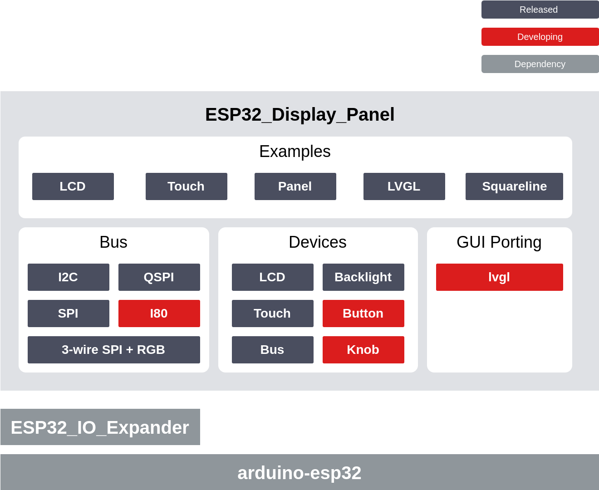

[](https://github.com/esp-arduino-libs/ESP32_Display_Panel/releases) [](https://github.com/esp-arduino-libs/ESP32_Display_Panel/actions/workflows/arduino_lint.yml) [](https://github.com/esp-arduino-libs/ESP32_Display_Panel/actions/workflows/pre-commit.yml)

# ESP Display Panel

* [English Version](./README.md)

ESP32_Display_Panel 是专为 ESP SoCs 设计的 Arduino 库，用于驱动显示屏并实现快速 GUI 开发。用户不仅可以直接开发多款[内部支持的开发板](docs/Board_Instructions.md)，还可以通过简单的适配来开发自定义的开发板。此外，ESP32_Display_Panel 还适配了多款 LCD 和触摸的驱动，用户也可以根据需要使用独立的驱动进行开发。

ESP32_Display_Panel 封装了多种[乐鑫组件库](https://components.espressif.com/)中相关的组件，需要基于 [arduino-esp32](https://github.com/espressif/arduino-esp32) 进行开发，并且可以直接从 Arduino IDE 中下载获取。

## 目录

- [ESP Display Panel](#esp-display-panel)
  - [目录](#目录)
  - [概述](#概述)
  - [支持的开发板和驱动](#支持的开发板和驱动)
    - [开发板](#开发板)
    - [LCD 控制器](#lcd-控制器)
    - [触摸控制器](#触摸控制器)
  - [依赖项及版本](#依赖项及版本)
  - [如何使用](#如何使用)
    - [配置说明](#配置说明)
      - [配置驱动](#配置驱动)
      - [使用支持的开发板](#使用支持的开发板)
      - [使用自定义开发板](#使用自定义开发板)
    - [示例说明](#示例说明)
      - [Arduino IDE](#arduino-ide)
        - [LCD](#lcd)
        - [Touch](#touch)
        - [Panel](#panel)
        - [LVGL v8](#lvgl-v8)
        - [SquareLine](#squareline)
      - [PlatformIO](#platformio)
  - [其他相关说明](#其他相关说明)
    - [配置支持的开发板](#配置支持的开发板)
    - [配置 LVGL](#配置-lvgl)
    - [移植 SquareLine 工程](#移植-squareline-工程)
  - [常见问题解答](#常见问题解答)
    - [Arduino 库的目录在哪儿？](#arduino-库的目录在哪儿)
    - [如何在 Arduino IDE 中安装 ESP32\_Display\_Panel？](#如何在-arduino-ide-中安装-esp32_display_panel)
    - [arduino-eps32 的安装目录以及 SDK 的目录在哪儿？](#arduino-eps32-的安装目录以及-sdk-的目录在哪儿)
    - [使用 ESP32-S3 驱动 RGB LCD 时出现画面漂移问题的解决方案](#使用-esp32-s3-驱动-rgb-lcd-时出现画面漂移问题的解决方案)
    - [如何在 PlatformIO 上使用 ESP32\_Display\_Panel？](#如何在-platformio-上使用-esp32_display_panel)

## 概述

ESP32_Display_Panel 的功能框图如下所示，主要包含以下特性：

- 支持多款乐鑫官方以及第三方开发板。
- 支持适配自定义的开发板。
- 支持使用独立的设备驱动。
- 支持多种类型的设备驱动，包括接口总线、LCD、触摸、背光。
- 支持动态配置驱动，如开启调试 LOG 等。

<div align="center"></div>

## 支持的开发板和驱动

### 开发板

下面是支持的[开发板列表](docs/Board_Instructions.md)：

| **厂商** | **开发板型号** |
| -------- | -------------- |
| [Espressif](docs/Board_Instructions.md#espressif) | ESP32-C3-LCDkit, ESP32-S3-BOX, ESP32-S3-BOX-3, ESP32-S3-BOX-3B, ESP32-S3-BOX-3(beta), ESP32-S3-BOX-Lite, ESP32-S3-EYE, ESP32-S3-Korvo-2, ESP32-S3-LCD-EV-Board, ESP32-S3-LCD-EV-Board-2, ESP32-S3-USB-OTG |
| [M5Stack](docs/Board_Instructions.md#m5stack) | M5STACK-M5CORE2, M5STACK-M5DIAL, M5STACK-M5CORES3 |
| [Elecrow](docs/Board_Instructions.md#elecrow) | CrowPanel 7.0" |
| [Jingcai](docs/Board_Instructions.md#shenzhen-jingcai-intelligent) | ESP32-4848S040C_I_Y_3 |
| [Waveshare](docs/Board_Instructions.md#waveshare) | ESP32-S3-Touch-LCD-4.3 |

欢迎开发者和厂商贡献 PR 来添加更多的开发板，详细说明请参考 [`开发板贡献指南`](./docs/Board_Contribution_Guide_CN.md)。

### LCD 控制器

下面是支持的 [LCD 控制器列表](docs/LCD_Controllers.md)：

| **厂商** | **型号** |
| -------- | -------- |
| Fitipower | EK9716B |
| GalaxyCore | GC9A01, GC9B71, GC9503 |
| Ilitek | ILI9341 |
| NewVision | NV3022B |
| Sitronix | ST7262, ST7701, ST7789, ST7796, ST77916, ST77922 |

### 触摸控制器

下面是支持的 [触摸控制器列表](docs/Touch_Controllers.md)：

| **厂商** | **型号** |
| -------- | -------- |
| Hynitron | CST816S |
| FocalTech | FT5x06 |
| GOODiX | GT911, GT1151 |
| Sitronix | ST7123 |
| Parade | TT21100 |
| Xptek | XPT2046 |

## 依赖项及版本

| **依赖项** | **版本** |
| ---------- | -------- |
| [arduino-esp32](https://github.com/espressif/arduino-esp32) | >= v3.0.0-alpha3 |
| [ESP32_IO_Expander](https://github.com/esp-arduino-libs/ESP32_IO_Expander) | >= 0.0.1 && < 0.1.0 |

## 如何使用

关于 ESP32_Display_Panel 库的安装，请参阅 [如何在 Arduino IDE 中安装 ESP32_Display_Panel](#如何在-arduino-ide-中安装-ESP32_Display_Panel)。

### 配置说明

下面是关于如何配置 ESP32_Display_Panel 的详细说明，主要包含了 [配置驱动](#配置驱动), [使用支持的开发板](#使用支持的开发板), [使用自定义开发板](#使用自定义开发板) 三个部分，这些均为可选操作并且都是通过指定的头文件进行配置，用户可以根据需要自行选择使用，它们具有如下的特点：

1. ESP32_Display_Panel 查找配置文件的路径顺序为：`当前工程目录` > `Arduino 库目录` > `ESP32_Display_Panel 目录`。
2. ESP32_Display_Panel 中所有的示例工程都默认包含了各自所需的配置文件，用户可以直接修改其中的宏定义。
3. 对于没有配置文件的工程，用户可以将其从 ESP32_Display_Panel 的根目录或者示例工程中复制到自己的工程中。
4. 如果有多个工程需要使用相同的配置，用户可以将配置文件放在 [Arduino 库目录](#arduino-库的目录在哪儿)中，这样所有的工程都可以共享相同的配置。

> [!WARNING]
> * 同一个目录下可以同时包含 `ESP_Panel_Board_Supported.h` 和 `ESP_Panel_Board_Custom.h` 两种配置文件，但是它们不能同时被使能，即 `ESP_PANEL_USE_SUPPORTED_BOARD` 和 `ESP_PANEL_USE_CUSTOM_BOARD` 最多只能有一个为 `1`。
> * 如果以上两个配置文件都被没有被使能，那么用户就无法使用 `ESP_Panel` 驱动，只能使用其他独立的设备驱动，如 `ESP_PanelBus`, `ESP_PanelLcd` 等。
> * 由于这些文件内的配置可能会发生变化，比如新增、删除或重命名，为了保证程序的兼容性，库对它们分别进行了独立的版本管理，并在编译时检查用户当前使用的配置文件与库是否兼容。详细的版本信息以及检查规则可以在文件的末尾处找到。

#### 配置驱动

ESP32_Display_Panel 会根据 [ESP_Panel_Conf.h](./ESP_Panel_Conf.h) 文件来配置驱动的功能和参数，用户可以通过修改此文件中的宏定义来更新驱动的行为或默认参数。以使能用于调试的 LOG 输出为例，下面是修改后的 `ESP_Panel_Conf.h` 文件的部分内容：

```c
...
/* Set to 1 if print log message for debug */
#define ESP_PANEL_ENABLE_LOG                (1)         // 0/1
...
```

#### 使用支持的开发板

ESP32_Display_Panel 会根据 [ESP_Panel_Board_Supported.h](./ESP_Panel_Board_Supported.h) 文件来配置 `ESP_Panel` 成为目标开发板的驱动，用户可以通过修改此文件中的宏定义来选择支持的开发板。以使用 *ESP32-S3-BOX-3* 开发板为例，修改步骤如下：

1. 设置 `ESP_Panel_Board_Supported.h` 文件中的 `ESP_PANEL_USE_SUPPORTED_BOARD` 宏定义为 `1`。
2. 根据目标开发板的型号，取消对应的宏定义的注释。

下面是修改后的 `ESP_Panel_Board_Supported.h` 文件的部分内容：

```c
...
/* Set to 1 if using a supported board */
#define ESP_PANEL_USE_SUPPORTED_BOARD       (1)         // 0/1

#if ESP_PANEL_USE_SUPPORTED_BOARD
...
// #define BOARD_ESP32_C3_LCDKIT
// #define BOARD_ESP32_S3_BOX
#define BOARD_ESP32_S3_BOX_3
// #define BOARD_ESP32_S3_BOX_3_BETA
...
#endif
```

#### 使用自定义开发板

ESP32_Display_Panel 会根据 [ESP_Panel_Board_Custom.h](./ESP_Panel_Board_Custom.h) 文件来配置 `ESP_Panel` 成为自定义开发板的驱动，用户需要根据自定义开发板的实际参数对此文件进行修改。以使用 *480x480 RGB ST7701 LCD + I2C GT911 Touch* 的自定义开发板为例，修改步骤如下：

1. 设置 `ESP_Panel_Board_Custom.h` 文件中的 `ESP_PANEL_USE_CUSTOM_BOARD` 宏定义为 `1`。
2. 设置 LCD 相关宏定义：
  a. 设置 `ESP_PANEL_USE_LCD` 为 `1`
  b. 设置 `ESP_PANEL_LCD_WIDTH` 和 `ESP_PANEL_LCD_HEIGHT` 为 `480`
  c. 设置 `ESP_PANEL_LCD_BUS_TYPE` 为 `ESP_PANEL_BUS_TYPE_RGB`。
  d. 在 `ESP_PANEL_LCD_BUS_TYPE == ESP_PANEL_BUS_TYPE_RGB` 下方的宏定义中设置 LCD 的信号引脚和其他参数。
  e. 根据屏厂提供的初始化命令参数，取消 `ESP_PANEL_LCD_VENDOR_INIT_CMD` 宏定义的注释并修改内容。
  f. 根据需要修改其他 LCD 配置
2. 设置 Touch 相关宏定义：
  a. 设置 `ESP_PANEL_USE_TOUCH` 为 `1`
  b. 在 `ESP_PANEL_TOUCH_BUS_TYPE == ESP_PANEL_BUS_TYPE_I2C` 下方的宏定义中设置 Touch 的信号引脚和其他参数。
  c. 根据需要修改其他 Touch 配置
3. 根据需要使能其他驱动的宏定义，如 `ESP_PANEL_USE_BACKLIGHT`, `ESP_PANEL_USE_EXPANDER` 等。

下面是修改后的 `ESP_Panel_Board_Custom.h` 文件的部分内容：

```c
...
/* Set to 1 if using a custom board */
#define ESP_PANEL_USE_CUSTOM_BOARD  (1)         // 0/1

/* Set to 1 when using an LCD panel */
#define ESP_PANEL_USE_LCD           (1)     // 0/1

#if ESP_PANEL_USE_LCD
/**
 * LCD Controller Name
 */
#define ESP_PANEL_LCD_NAME          ST7701

/* LCD resolution in pixels */
#define ESP_PANEL_LCD_WIDTH         (480)
#define ESP_PANEL_LCD_HEIGHT        (480)
...
/**
 * LCD Bus Type.
 */
#define ESP_PANEL_LCD_BUS_TYPE      (ESP_PANEL_BUS_TYPE_RGB)
/**
 * LCD Bus Parameters.
 *
 * Please refer to https://docs.espressif.com/projects/esp-idf/en/latest/esp32s3/api-reference/peripherals/lcd.html and
 * https://docs.espressif.com/projects/esp-iot-solution/en/latest/display/lcd/index.html for more details.
 *
 */
#if ESP_PANEL_LCD_BUS_TYPE == ESP_PANEL_BUS_TYPE_RGB
...
#endif /* ESP_PANEL_LCD_BUS_TYPE */
...
/**
 * LCD Vendor Initialization Commands.
 *
 * Vendor specific initialization can be different between manufacturers, should consult the LCD supplier for
 * initialization sequence code. Please uncomment and change the following macro definitions. Otherwise, the LCD driver
 * will use the default initialization sequence code.
 *
 * There are two formats for the sequence code:
 *   1. Raw data: {command, (uint8_t []){ data0, data1, ... }, data_size, delay_ms}
 *   2. Formater: ESP_PANEL_LCD_CMD_WITH_8BIT_PARAM(delay_ms, command, { data0, data1, ... }) and
 *                ESP_PANEL_LCD_CMD_WITH_NONE_PARAM(delay_ms, command)
 */
#define ESP_PANEL_LCD_VENDOR_INIT_CMD() \
    { \
        ESP_PANEL_LCD_CMD_WITH_8BIT_PARAM(0, 0xFF, {0x77, 0x01, 0x00, 0x00, 0x10}), \
        ESP_PANEL_LCD_CMD_WITH_8BIT_PARAM(0, 0xC0, {0x3B, 0x00}), \
        ESP_PANEL_LCD_CMD_WITH_8BIT_PARAM(0, 0xC1, {0x0D, 0x02}), \
        ESP_PANEL_LCD_CMD_WITH_8BIT_PARAM(0, 0xC2, {0x31, 0x05}), \
        ESP_PANEL_LCD_CMD_WITH_8BIT_PARAM(0, 0xCD, {0x00}), \
        ...
        ESP_PANEL_LCD_CMD_WITH_NONE_PARAM(120, 0x11), \
    }
...
#endif /* ESP_PANEL_USE_LCD */

/* Set to 1 when using an touch panel */
#define ESP_PANEL_USE_TOUCH         (1)         // 0/1
#if ESP_PANEL_USE_TOUCH
/**
 * Touch controller name
 */
#define ESP_PANEL_TOUCH_NAME        GT911
...
/**
 * Touch panel bus type
 */
#define ESP_PANEL_TOUCH_BUS_TYPE    (ESP_PANEL_BUS_TYPE_I2C)
/* Touch panel bus parameters */
#if ESP_PANEL_TOUCH_BUS_TYPE == ESP_PANEL_BUS_TYPE_I2C
...
#endif /* ESP_PANEL_TOUCH_BUS_TYPE */
...
#endif /* ESP_PANEL_USE_TOUCH */
...
#define ESP_PANEL_USE_BACKLIGHT     (1)         // 0/1
#if ESP_PANEL_USE_BACKLIGHT
...
#endif /* ESP_PANEL_USE_BACKLIGHT */
...
#endif /* ESP_PANEL_USE_CUSTOM_BOARD */
```

### 示例说明

以下是在不同开发平台下使用 ESP32_Display_Panel 的一些示例。

#### Arduino IDE

你可以在 Arduino IDE 中导航到 `File` > `Examples` > `ESP32_Display_Panel` 来访问它们。如果你找不到 `ESP32_Display_Panel` 选项，请检查库是否已正确安装，并确认选择了一个 ESP 开发板。

##### LCD

以下示例演示了如何使用独立的驱动开发不同接口和不同型号的 LCD，并通过显示彩条进行测试：

* [SPI](examples/LCD/SPI/)
* [QSPI](examples/LCD/QSPI/)
* [Single RGB](examples/LCD/RGB/)
* [3-wire SPI + RGB](examples/LCD/3wireSPI_RGB/)

##### Touch

以下示例演示了如何使用独立的驱动开发不同接口和不同型号的触摸屏，并通过打印触摸点坐标进行测试：

* [I2C](examples/Touch/I2C/)
* [SPI](examples/Touch/SPI/)

##### Panel

以下示例演示了如何使用 `ESP_Panel` 驱动开发内置或自定义的开发板：

* [Panel Test](examples/Panel/PanelTest/)：此示例通过显示彩条和打印触摸点坐标进行测试。

##### LVGL v8

关于如何配置 LVGL（v8.3.x），请参阅[此处](#配置-lvgl)以获取更多详细信息。

* [Porting](examples/LVGL/v8/Porting/): 此示例演示了如何移植 LVGL（v8.3.x）。对于 RGB LCD，它还可以启用防撕裂功能。
* [Rotation](examples/LVGL/v8/Rotation/): 此示例演示了如何使用 LVGL 来旋转显示屏。

> [!WARNING]
> 目前，防撕裂功能仅支持 RGB LCD，并且需要 LVGL 的版本满足 >= v8.3.9，如果使用的是其他类型的 LCD 或不符合要求的 LVGL 版本，请不要启用此功能。

##### SquareLine

​	要移植 Squarelina 项目（v1.3.x），请参阅[此处](#移植-SquareLine-工程)获取更多详细信息。

- [Porting](examples/SquareLine/v8/Porting): 此示例演示了如何移植 SquareLine 项目。
- [WiFiClock](examples/SquareLine/v8/WiFiClock): 此示例实现了一个简单的 Wi-Fi 时钟，并且可以显示天气信息。

#### PlatformIO

- [PlatformIO](examples/PlatformIO/): 此示例演示了如何在 PlatformIO 中使用 ESP32_Display_Panel。它默认情况下适用于 **ESP32-S3-LCD-EV-Board** and **ESP32-S3-LCD-EV-Board-2** 开发板，用户需要根据实际情况修改 [boards/ESP-LCD.json](examples/PlatformIO/boards/ESP-LCD.json) 文件。

## 其他相关说明

### 配置支持的开发板

关于如何在 Arduino IDE 中配置支持的开发板，请参考 [Board_Instructions - Recommended Configurations in the Arduino IDE](./docs/Board_Instructions.md#recommended-configurations-in-the-arduino-ide).

### 配置 LVGL

LVGL 的功能和参数可以通过编辑 `lv_conf.h` 文件来进行配置，用户可以修改此文件中的宏定义以更新驱动的行为或默认参数。以下是配置 LVGL 的一些特点和步骤：

1. 在使用 arduino-esp32 v3.x.x 版本时，LVGL 会按照以下路径顺序查找配置文件：`当前工程目录` > `Arduino 库目录`。如果未找到配置文件，编译时会提示未找到配置文件的错误，因此用户需要确保至少有一个目录中包含 `lv_conf.h` 文件。

2. 如果多个工程需要使用相同的配置，用户可以将配置文件放在 [Arduino 库目录](#arduino-库的目录在哪儿)中，这样所有工程都可以共享相同的配置。

下面是共享相同 LVGL 配置的详细设置步骤：

1. 导航到 [Arduino 库目录](#arduino-库的目录在哪儿)。

2. 进入 `lvgl` 文件夹，复制 `lv_conf_template.h` 文件，并将副本放在与 `lvgl` 文件夹同一级的位置，然后将复制的文件重命名为 `lv_conf.h`。

3. 最终，Arduino 库文件夹的布局如下所示：

   ```
   Arduino
       |-libraries
           |-lv_conf.h
           |-lvgl
           |-other_lib_1
           |-other_lib_2
   ```

4. 打开 `lv_conf.h` 文件，并将第一个 `#if 0` 修改为 `#if 1` 以启用文件的内容。

5. 根据需求设置其他配置。以下是一些常见的 LVGL v8 版本的配置项示例：

   ```c
   #define LV_COLOR_DEPTH          16  // 通常使用 16 位色深（RGB565），
                                       // 但也可以将其设置为 `32` 来支持 24 位色深（RGB888）
   #define LV_COLOR_16_SWAP        0   // 如果使用 SPI/QSPI LCD（例如 ESP32-C3-LCDkit），需要将其设置为 `1`
   #define LV_COLOR_SCREEN_TRANSP  1
   #define LV_MEM_CUSTOM           1
   #define LV_MEMCPY_MEMSET_STD    1
   #define LV_TICK_CUSTOM          1
   #define LV_ATTRIBUTE_FAST_MEM   IRAM_ATTR
                                      // 获取更高的性能但占用更多的 SRAM
   #define LV_FONT_MONTSERRAT_N    1  // 启用所有需要使用的内部字体（`N`应该替换为字体大小）
   ```

6. 获取更多信息，请参考[ LVGL 官方文档](https://docs.lvgl.io/8.3/get-started/platforms/arduino.html)。

### 移植 SquareLine 工程

SquareLine Studio (v1.3.x) 可以通过图像化编辑的方式快速设计精美的 UI。如果想要在 Arduino IDE 中使用 SquareLine 导出的 UI 源文件，可以按照以下步骤进行移植：

1. 首先，在 SquareLine Studio 中创建一个新的工程，进入 `Create` -> `Arduino` 一栏，选择 `Arduino with TFT-eSPI` 作为工程模板，然后在右侧的 `PROJECT SETTINGS` 一栏需要根据目标开发板的 LCD 属性进行配置，如 `Resolution` and `Color depth`，最后点击 `Create` 按钮创建工程。

2. 对于已有的工程，也可以在导航栏中点击 `File` -> `Project Settings` 按钮进入工程设置，然后在 `BOARD PROPERTIES` 一栏配置 `Board Group` 为 `Arduino`，`Board` 为 `Arduino with TFT-eSPI`，并且根据目标开发板的 LCD 属性在 `DISPLAY PROPERTIES` 一栏进行配置，最后点击 `Save` 按钮保存工程设置。

3. 完成 UI 设计并且配置好导出路径后，即可依次点击菜单栏中的 `Export` -> `Create Template Project` 和 `Export UI Files` 按钮导出工程及 UI 源文件，该工程目录的布局如下所示：

    ```
    Project
        |-libraries
            |-lv_conf.h
            |-lvgl
            |-readme.txt
            |-TFT_eSPI
            |-ui
        |-README.md
        |-ui
    ```

4. 将工程目录下的 `libraries` 文件夹中的 `lv_conf.h`、`lvgl` 和 `ui` 复制到 Arduino 库目录中。如果需要使用本地安装的 `lvgl`，请跳过复制 `lvgl` 和 `lv_conf.h`，然后参考[步骤](#配置-lvgl)来配置 LVGL。Arduino 库文件夹的布局如下：

    ```
    Arduino
        |-libraries
            |-ESP32_Display_Panel
            |-ESP_Panel_Conf.h (可选)
            |-lv_conf.h (可选)
            |-lvgl
            |-ui
            |-other_lib_1
            |-other_lib_2
    ```

## 常见问题解答

### Arduino 库的目录在哪儿？

您可以在 Arduino IDE 的菜单栏中选择 `File` > `Preferences` > `Settings` > `Sketchbook location` 来查找和修改 Arduino 库的目录路径。

### 如何在 Arduino IDE 中安装 ESP32_Display_Panel？

- 如果您想要在线安装，可以在 Arduino IDE 中导航到 `Sketch` > `Include Library` > `Manage Libraries...`，然后搜索 `ESP32_Display_Panel`，点击 `Install` 按钮进行安装。
- 如果您想要手动安装，可以从 [ESP32_Display_Panel](https://github.com/esp-arduino-libs/ESP32_Display_Panel) 下载所需版本的 `.zip` 文件，然后在 Arduino IDE 中导航到 `Sketch` > `Include Library` > `Add .ZIP Library...`，选择下载的 `.zip` 文件并点击 `Open` 按钮进行安装。
- 您还可以查阅 [Arduino IDE v1.x.x](https://docs.arduino.cc/software/ide-v1/tutorials/installing-libraries) 或者 [Arduino IDE v2.x.x](https://docs.arduino.cc/software/ide-v2/tutorials/ide-v2-installing-a-library) 文档中关于安装库的指南。

### arduino-eps32 的安装目录以及 SDK 的目录在哪儿？

arduino-esp32 的默认安装路径取决于您的操作系统：

- Windows: `C:\Users\<user name>\AppData\Local\Arduino15\packages\esp32`
- Linux: `~/.arduino15/packages/esp32`

arduino-esp32 v3.x.x 版本的 SDK 位于默认安装路径下的 `tools > esp32-arduino-libs > idf-release_x` 目录中。

### 使用 ESP32-S3 驱动 RGB LCD 时出现画面漂移问题的解决方案

当您在使用 ESP32-S3 驱动 RGB LCD 时遇到画面漂移的问题时，您可以采用以下步骤来解决：

1. **查看文档**：详细了解问题的说明，您可以参考[这篇文档](https://docs.espressif.com/projects/esp-faq/zh_CN/latest/software-framework/peripherals/lcd.html#esp32-s3-rgb-lcd)。

2. **启用 `Bounce Buffer + XIP on PSRAM` 特性**：为了解决问题，推荐启用 `Bounce Buffer + XIP on PSRAM` 特性。具体步骤如下：

   - **Step1**：从 [arduino-esp32-sdk](https://github.com/esp-arduino-libs/arduino-esp32-sdk) 下载 "high_perf" 版本的 SDK，并将其替换到 [arduino-esp32 的安装目录](#arduino-eps32-的安装目录以及-sdk-的目录在哪儿)中。

   - **Step2**：如果您使用的是支持的开发板，则通常无需修改代码，因为它们默认设置了 `ESP_PANEL_LCD_RGB_BOUNCE_BUF_SIZE` 为 `(ESP_PANEL_LCD_WIDTH * 10)`。如果问题仍然存在，请参考下面的示例代码来增大 `Bounce Bufer` 的大小。

   - **Step3**：如果您使用的是自定义的开发板，请在 `ESP_Panel_Board_Custom.h` 文件中确认 `ESP_PANEL_LCD_RGB_BOUNCE_BUF_SIZE` 是否设置为非 0。如果问题仍然存在，请增大 `Bounce Bufer` 的大小。

   - **Step4**：如果您使用的是独立的驱动，请参考下面的示例代码来设置 `Bounce Bufer` 的大小。

3. **示例代码**：以下示例代码展示了如何通过 `ESP_Panel` 驱动或独立的驱动来修改 `Bounce Bufer` 的大小：

   **Example1**：使用 `ESP_Panel` 驱动修改 `Bounce Bufer` 大小：

    ```c
    ...
    ESP_Panel *panel = new ESP_Panel();
    panel->init();
    // Start
    ESP_PanelBus_RGB *rgb_bus = static_cast<ESP_PanelBus_RGB *>(panel->getLcd()->getBus());
    // The size of the bounce buffer must satisfy `width_of_lcd * height_of_lcd = size_of_buffer * N`, where N is an even number.
    rgb_bus->configRgbBounceBufferSize((ESP_PANEL_LCD_WIDTH * 20));
    // End
    panel->begin();
    ...
    ```

   **Example2**：使用独立的驱动修改 `Bounce Bufer` 大小：

    ```c
    ...
    ESP_PanelBus_RGB *lcd_bus = new ESP_PanelBus_RGB(...);
    // Start
    // The size of the bounce buffer must satisfy `width_of_lcd * height_of_lcd = size_of_buffer * N`, where N is an even number.
    lcd_bus->configRgbBounceBufferSize(EXAMPLE_LCD_WIDTH * 10);
    // End
    lcd_bus->begin();
    ...
    ```

### 如何在 PlatformIO 上使用 ESP32_Display_Panel？

您可以参考示例 [PlatformIO](examples/PlatformIO/) 在 PlatformIO 中使用 ESP32_Display_Panel 库，它默认情况下适用于 **ESP32-S3-LCD-EV-Board** and **ESP32-S3-LCD-EV-Board-2** 开发板，您需要根据实际情况修改 [boards/ESP-LCD.json](examples/PlatformIO/boards/ESP-LCD.json) 文件。
